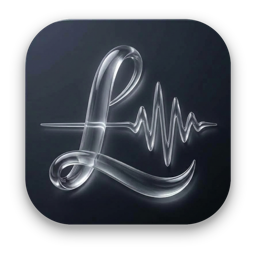
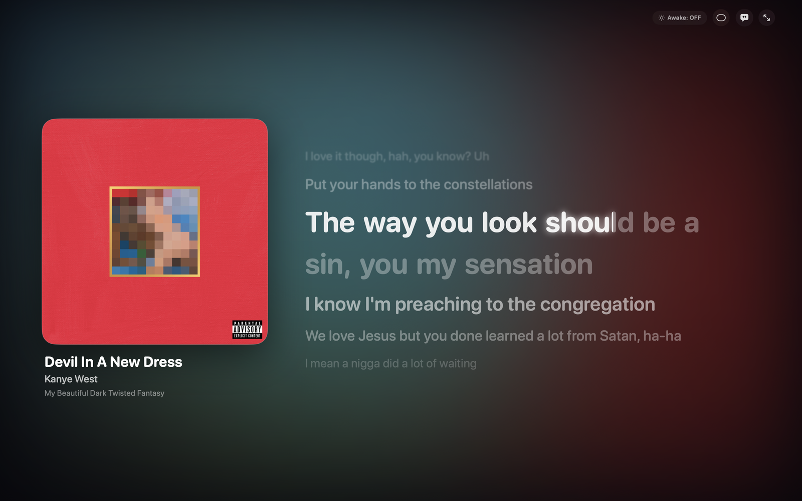
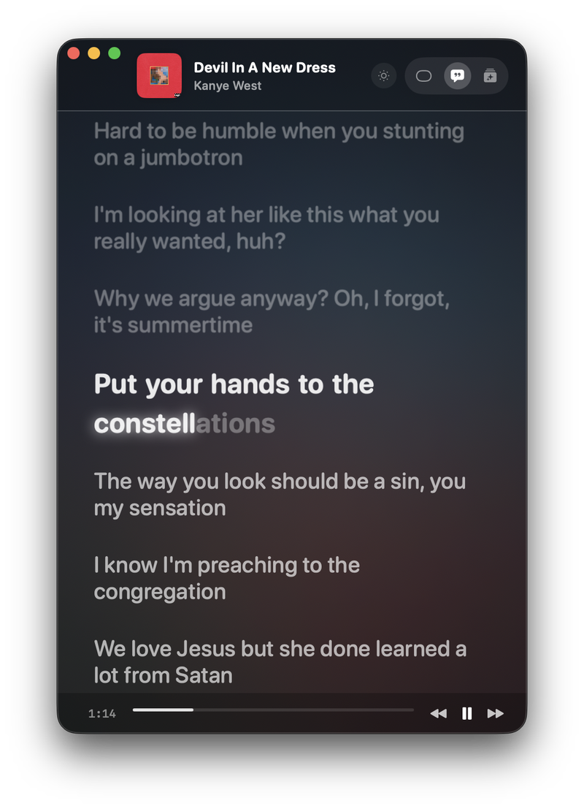
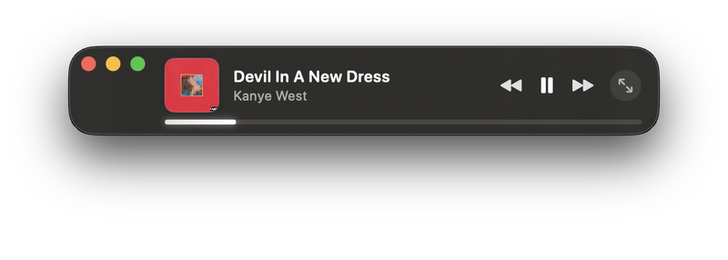
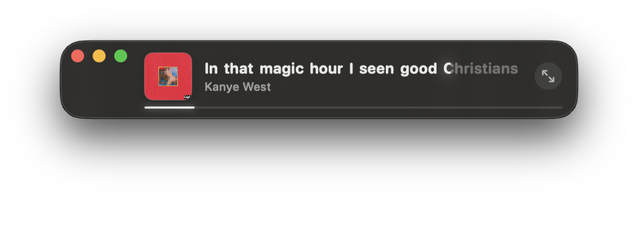
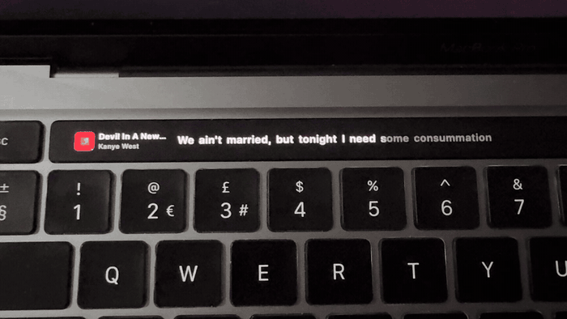
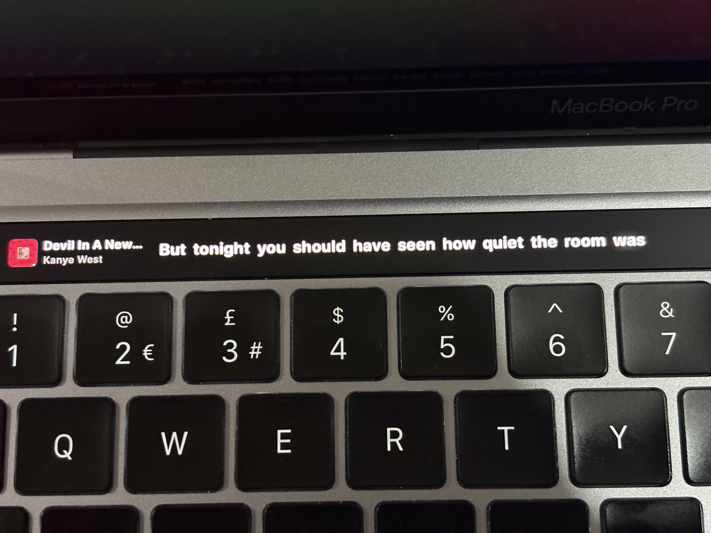

<p align="center">
  
</p>

# Lyricora 🎵 ✨

> **Made by [r1hix](https://github.com/r1hix)**  
> High-performance, battery-efficient, native macOS menu bar and living floating lyrics visualizer for Spotify.

[](https://apple.com)
[](https://swift.org)
[](https://spotify.com)
[](https://github.com/r1hix/Lyricora.git)

---

<p align="center">
  
</p>

---

## 🌟 Highlights

**Lyricora** is an ultra-fluid, native macOS application built with SwiftUI, AppKit, and CoreGraphics. It transforms your Spotify listening experience with real-time synchronized karaoke lyrics, interactive dynamic backdrops, Touch Bar support, and seamless overlay modes.

- **Zero-Polling Event Engine**: Powered entirely by macOS `DistributedNotificationCenter` (`com.spotify.client.PlaybackStateChanged`). Zero background timers, zero shell loops.
- **Monotonic Clock Interpolation**: Sub-millisecond drift correction using monotonic media time (`CACurrentMediaTime()`). When playback pauses, Lyricora drops to **0% CPU usage**.
- **Living 60/120Hz ProMotion Karaoke Typography**: Uses SwiftUI's modern `TextRenderer` API (`KaraokeWordRenderer`) with progressive clip masks and blooming lead glow.
- **Dynamic Ambient Color Mesh**: Samples real-time album artwork via CoreGraphics to compute vibrant, harmonic gradients with hardware-accelerated GPU blur.
- **Interactive Touch Bar Lyrics**: Live streaming karaoke text directly on the MacBook Pro Touch Bar with custom control strip integration.
- **Display Sleep Prevention**: Built-in caffeinate toggle using `IOKit.pwr_mgt` to keep your screen awake while listening.

---

## 🎛️ Three Dynamic View Modes

Lyricora adapts seamlessly to your workflow with three tailored presentation modes:

| Mode | Dimensions | Description |
| :--- | :--- | :--- |
| **Mini HUD** | `480 × 72` | Compact floating pill with ultra-thin material, artwork thumbnail, track metadata, active karaoke line, and hover transport controls. |
| **Full Lyrics** | `460 × 680` | Glassmorphic floating window with auto-scrolling lyrics stream, smooth spring physics, click-to-seek, and instrumental detection. |
| **Ambient Canvas** | `900 × 650` / Fullscreen | Immersive stage with living lyrics, breathing album artwork, and radiant color orbs. Transport controls fade automatically on idle. |

### Floating Windows: Full Lyrics & Mini HUD

<table>
  <tr>
    <th width="48%" align="center">Full Lyrics Window (<code>460 × 680</code>)</th>
    <th width="52%" align="center">Mini HUD Floating Pill (<code>480 × 72</code>)</th>
  </tr>
  <tr>
    <td align="center">
      
      <p><em>Auto-scrolling lyrics stream with blooming active word glow</em></p>
    </td>
    <td align="center">
      <p><strong>Track Metadata & Hover Controls</strong></p>
      
      <br/><br/>
      <p><strong>Synchronized Karaoke Line</strong></p>
      
      <p><em>Ultra-compact floating pill with progress bar and mode toggle</em></p>
    </td>
  </tr>
</table>

---

## 💻 Native Touch Bar Lyrics

Real-time synchronized karaoke lyrics streaming directly across your MacBook Pro Touch Bar, integrated with native AppKit control strip items and media transport controls.

<p align="center">
  
</p>

<details>
  <summary>📸 <strong>View High-Resolution Touch Bar Still</strong></summary>
  <br/>
  <p align="center">
    
  </p>
</details>

---

## 🚀 Quick Start

### Prerequisites
- macOS 14.0 (Sonoma) or newer (Apple Silicon & Intel supported)
- Swift 5.10+ / Xcode 15+ Command Line Tools
- Spotify Desktop app

### 1. Download & Launch
1. Download **`Lyricora-v1.0.0-macOS.zip`** from [Releases](https://github.com/r1hix/Lyricora/releases).
2. Unzip and drag `Lyricora.app` into `/Applications`.
3. Open `Lyricora.app` and start playing any track in Spotify!

> [!TIP]
> **First-time launch on macOS Gatekeeper**: Because Lyricora is an open-source ad-hoc signed app, right-click (or Control-click) `Lyricora.app` and choose **Open**, then click **Open** in the prompt (or run `xattr -cr /Applications/Lyricora.app` in Terminal).

### 2. Or Build From Source
```bash
git clone https://github.com/r1hix/Lyricora.git
cd Lyricora

# Run unit test suite
swift test

# Build Universal .app bundle (Apple Silicon + Intel)
./build_app.sh

# Launch
open build/Lyricora.app
```

---

## 📂 Project Structure

```
Lyricora/
├── Package.swift                    # SwiftPM manifest targeting macOS 14+
├── build_app.sh                     # Automated universal .app bundler script
├── Resources/
│   ├── AppIcon.icns                 # High-resolution macOS application icon bundle
│   └── AppIcon.png                  # Documentation icon preview
├── Screenshots/                     # Optimized visualizer captures, UI states & Touch Bar GIF
├── Sources/
│   └── Lyricora/
│       ├── App/
│       │   ├── LyricoraApp.swift    # MenuBarExtra & NSApplication lifecycle
│       │   └── WindowManager.swift  # Floating NSWindow controller & animated resizing
│       ├── Models/
│       │   ├── PlaybackState.swift  # Track, PlaybackStatus, ViewMode, TouchBarMode
│       │   └── LyricModels.swift    # LyricWord, LyricLine, LyricsPayload
│       ├── Services/
│       │   ├── SpotifyObserver.swift# Distributed notification listener & interpolated clock
│       │   ├── LyricsService.swift  # LRCLIB API fetcher & enhanced LRC parser
│       │   ├── TouchBarService.swift# Touch Bar integration & DFR system tray
│       │   └── SleepPreventerService.swift # IOKit power management assertions
│       ├── Rendering/
│       │   └── KaraokeTextRenderer.swift # TextRenderer & unified KaraokeWordText
│       └── Views/
│           ├── AmbientBackdropView.swift # Dynamic palette extractor & blurred mesh canvas
│           ├── LyricsView.swift     # Auto-scrolling lyrics stream & karaoke renderer
│           ├── MiniHUDView.swift    # Compact floating pill HUD with hover controls
│           ├── AmbientCanvasView.swift   # Fullscreen visualizer with breathing artwork
│           ├── TouchBarLyricsView.swift  # Touch Bar rendering views
│           ├── WindowDragHandle.swift    # Custom interactive drag views
│           └── ContentView.swift    # Master window host with mode switching
└── Tests/
    └── LyricoraTests/
        └── LyricoraTests.swift     # Parsing, interpolation, & LRCLIB integration tests
```

---

## 🛠️ Credits & Attribution

- **Made by [r1hix](https://github.com/r1hix)**
- Lyrics powered by [LRCLIB](https://lrclib.net/)
- Audio integration via Spotify macOS AppleScript & Distributed Notifications
